<p align="center">
  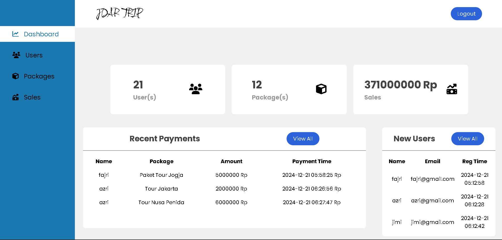
  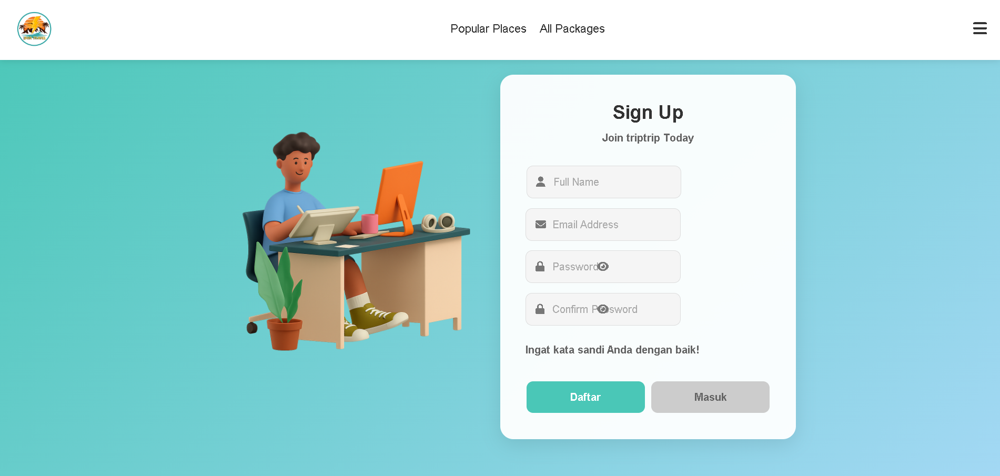
  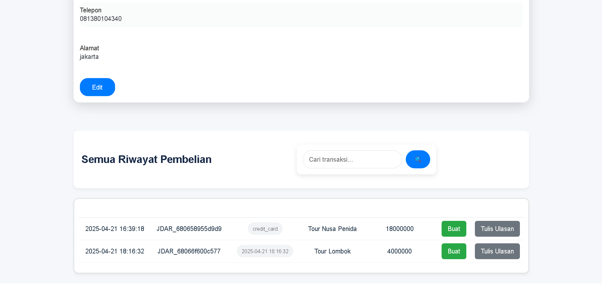
  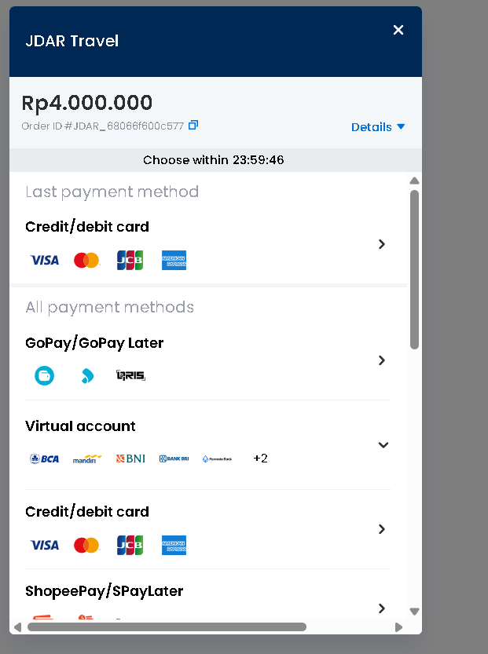
  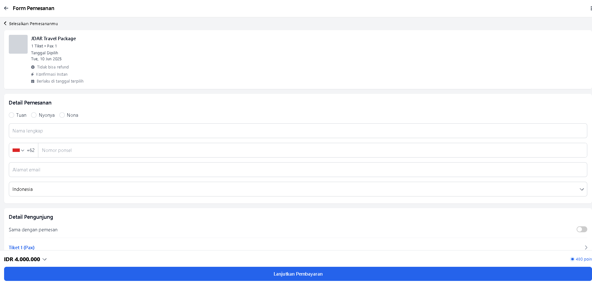
  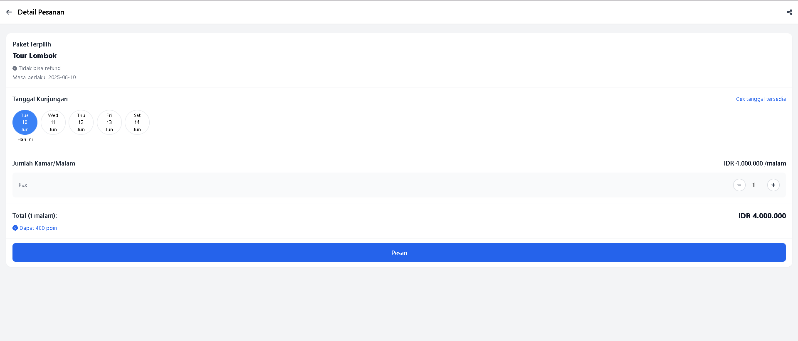
  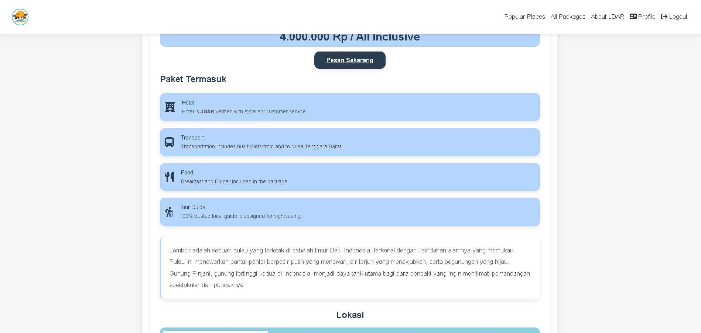
  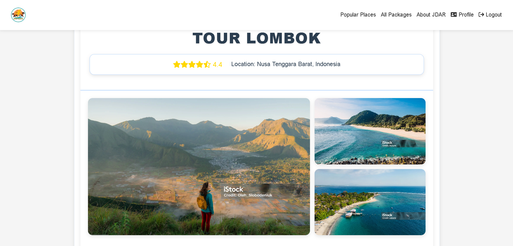
  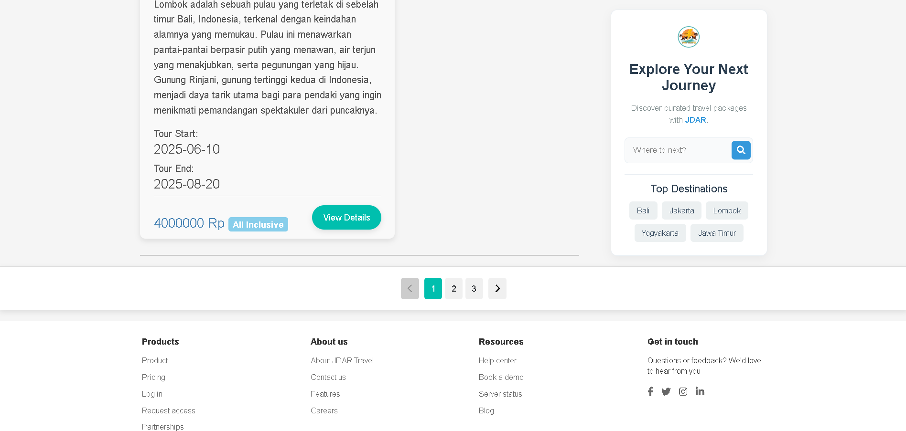
  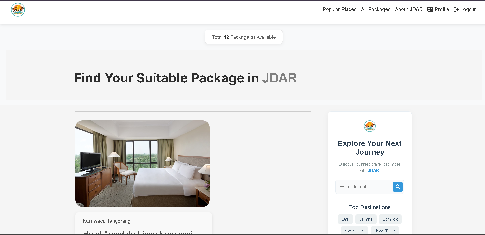
  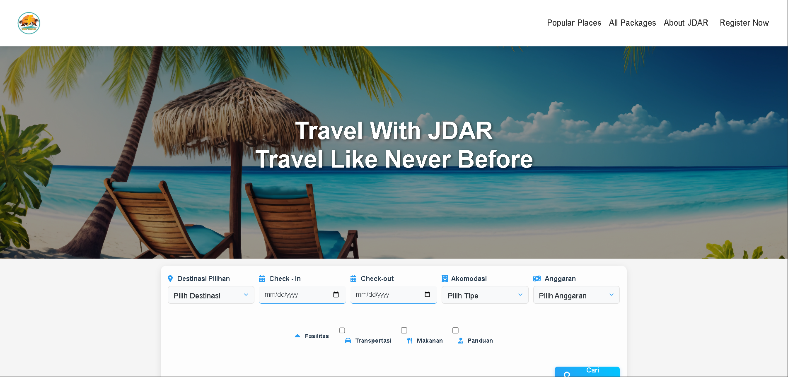
</p>


# 🌍 JDAR Travel

**JDAR Travel** adalah aplikasi web full-stack ✨ yang dibangun dengan **PHP murni** untuk mengelola berbagai paket wisata dan perjalanan.  
Pengguna dapat **menjelajah 🧭, mencari 🔍, membeli 🛒**, serta menulis ulasan dan menghasilkan laporan PDF 📄.  
Admin dapat **mengelola pengguna 👥, paket wisata 🧳, penjualan 💰**, dan menghasilkan laporan 🗂️.  
Terintegrasi dengan **Midtrans** untuk pemrosesan pembayaran yang **aman 🔐 dan cepat⚡**.

---

## 🚀 Fitur Utama

### 👤 Pengguna
- ✅ **Validasi Pengguna**: Pastikan username dan email unik saat login & daftar. Email konfirmasi dikirim setelah pendaftaran (`api/register.php`, `services/phpmailer/`).
- 🛑 **Validasi Pembelian Paket**: Tidak bisa beli paket sama dua kali, atau paket yang sudah dimulai / penuh (`order_form.php`, `packageAvailability.php`).
- 📧 **Notifikasi Email**: Email otomatis dikirim setelah pembelian sukses (`success.php`).
- 📝 **Ulasan & Laporan**: Kirim ulasan dan unduh laporan PDF setelah pembelian (`user_review.php`, `sales_pdf.php`).
- 🔎 **Pencarian & Jelajah**: Cari paket via beranda atau jelajahi semua paket (`searchPackages.php`, `package.php`).
- ⭐ **Pembaruan Real-Time**: Rating paket diperbarui langsung setelah ulasan dikirim (`countStars.php`).

### 🛠️ Admin
- 🎒 **Manajemen Paket**: Tambah, ubah, dan lihat detail paket wisata (`new_package.php`, `packageAvailability.php`).
- 🧑‍💼 **Manajemen Pengguna**: Aktif/nonaktifkan akun pengguna (`user_update.php`).
- 📊 **Penjualan & Laporan**: Lihat data penjualan dan hasilkan PDF (`admin_dashboard.php`, `sales_pdf.php`, `generatePDF.php`).
- 📋 **Dashboard Admin**: Kontrol penuh aplikasi dari satu tempat (`admin_dashboard.php`).

---

## 🐞 Bug yang Diketahui

🔍 Periksa file `app/dbConnection.php` jika ada masalah koneksi atau query database.

---

## 🧱 Struktur Proyek

- `api/` – Endpoint API untuk login dan registrasi.
- `app/` – File inti aplikasi, termasuk koneksi database.
- `assets/` – Aset statis: CSS, JS, gambar.
- `auth/` – Komponen autentikasi.
- `components/` – Header, footer, navigasi, dll.
- `services/` – Layanan backend seperti checkout & transaksi.
- `utilities/` – Fungsi tambahan (ex: rating bintang).
- `logs/` – Log autentikasi & transaksi Midtrans.
- File penting:
  - `index.php`, `package.php`, `success.php`
  - `composer.json`, `tailwind.css`

---

## ⚙️ Prasyarat

- ✅ PHP 7.4+
- ✅ Database MySQL
- ✅ Composer
- ✅ Akun Midtrans Sandbox
- ✅ Web server (Apache/Nginx) dengan dukungan PHP
- ✅ Code editor (VSCode, PhpStorm, dll.)

💡 **Tips:** Gunakan XAMPP atau Laragon untuk development lokal.

---

## 📦 Instalasi

1. **Clone Repository:**
```bash
git clone https://github.com/rahmatyudi/jdar-travel.git
cd jdar-travel
```

2. **Pasang Dependensi:**
```bash
composer install
```

3. **Setup Database:**
- Buat database baru `triptip`
- Import schema dari `app/db.sql`
- Update konfigurasi di `app/dbConnection.php`

4. **Konfigurasi Midtrans:**
Buat file `.env` lalu tambahkan:
```env
MIDTRANS_SERVER_KEY=server-key-anda
MIDTRANS_CLIENT_KEY=client-key-anda
MIDTRANS_IS_PRODUCTION=false
```

5. **Konfigurasi PHPMailer (Opsional):**
Edit di `api/register.php` & `success.php`
```php
$mail->Username = 'email-anda@gmail.com';
$mail->Password = 'password-email-anda';
```
Pastikan SMTP aktif di email Anda.

6. **Jalankan Aplikasi:**
```bash
php -S localhost:8000
```
🌐 Buka di browser: [http://localhost:8000](http://localhost:8000)

---

## 🧭 Panduan Penggunaan

### Untuk Pengguna
- 📥 Daftar/Login → `api/register.php`, `api/login.php`
- 🔍 Cari & jelajahi paket → `searchPackages.php`, `package.php`
- 🛒 Pesan paket → `order_form.php`
- 💸 Bayar via Midtrans (VA, QRIS, dll.)
- 📝 Tulis ulasan → `user_review.php`
- 📄 Cetak laporan → `sales_pdf.php`

### Untuk Admin
- 🔐 Login → `admin_login.php`
- 🧳 Kelola Paket → `new_package.php`, `packageAvailability.php`
- 👥 Kelola Pengguna → `user_update.php`
- 📈 Lihat Penjualan & Laporan → `sales_pdf.php`, `generatePDF.php`
- 🧭 Dashboard → `admin_dashboard.php`

---

## 📄 Lisensi

Proyek ini open-source dan bebas digunakan untuk keperluan edukasi atau pengembangan lebih lanjut.

---

## 🙌 Kontribusi

Pull request dan feedback sangat diterima!  
Silakan fork dan kirim PR jika ingin menambahkan fitur atau perbaikan.

---

## 👨‍💻 Developer

Dibuat oleh [Rahmat Yudi Burhanudin](https://github.com/rahmatyudi) 💻  
Email     : dewarahmat12334@gmail.com
Terima kasih telah menggunakan JDAR Travel! 🎒🌴
